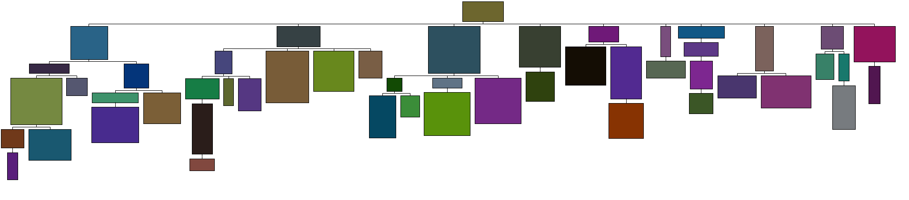

# draw tree
code accompanying the paper "Drawing Non-layered Tidy Trees in Linear Time", 
see https://core.ac.uk/download/pdf/301654972.pdf or the copy in this repo algorithm.pdf

## how to run
1. git clone
2. maven build
3. run swt/TestInterface

